# Jenkins (in Docker) Setup

These instructions will install and run a Jenkins container which will allow you to run Jenkins on your computer using Docker agents in a pipeline.

Since we will be using "Docker agents" in the Jenkins pipeline, the Jenkins container will need to be able to access your local Docker server.  

Do do this we will open up permissions on the docker socket. 

**Warning: This is not a good thing to do in a production environment as it is not secure**

    sudo chmod 777 /var/run/docker.sock

Now we need to pull and run the Jenkins docker image:

```bash 
docker run -p 8080:8080 \
  -v /var/run/docker.sock:/var/run/docker.sock \
  --name jenkins \
  jenkins/jenkins
```
Keep this terminal open. Also you should see some lines which looks similar to the following (the actual admin password will be different):

    Jenkins initial setup is required. An admin user has been created and a password generated.
    Please use the following password to proceed to installation:

    f1f844d7f6b447e9abb596ad998fd115

    This may also be found at: /var/jenkins_home/secrets/initialAdminPassword

You'll need to copy this password later on, so you'll come back to this window later.

We now need to connect to the Jenkins container and install the docker CLI inside the container.  

Open a **new terminal** and type: 

    docker exec -it -u root jenkins bash

You are now connected to the Jenkins container and can issue bash commands inside the container.

This next step installs the Docker CLI in the Jenkins container.

Copy and paste the following:


    apt-get update && \
    apt-get -y install apt-transport-https \
        ca-certificates \
        curl \
        gnupg2 \
        software-properties-common && \
    curl -fsSL https://download.docker.com/linux/$(. /etc/os-release; echo "$ID")/gpg > /tmp/dkey; apt-key add /tmp/dkey && \
    add-apt-repository \
    "deb [arch=amd64] https://download.docker.com/linux/$(. /etc/os-release; echo "$ID") \
    $(lsb_release -cs) \
    stable" && \
    apt-get update && \
    apt-get -y install docker-ce && \
    usermod -a -G docker jenkins && \
    exit

## Configuring Jenkins

Open http://localhost:8080 to access your Jenkins server running in a Docker container

You'll be asked to enter the Admin password:

<p align="center">
  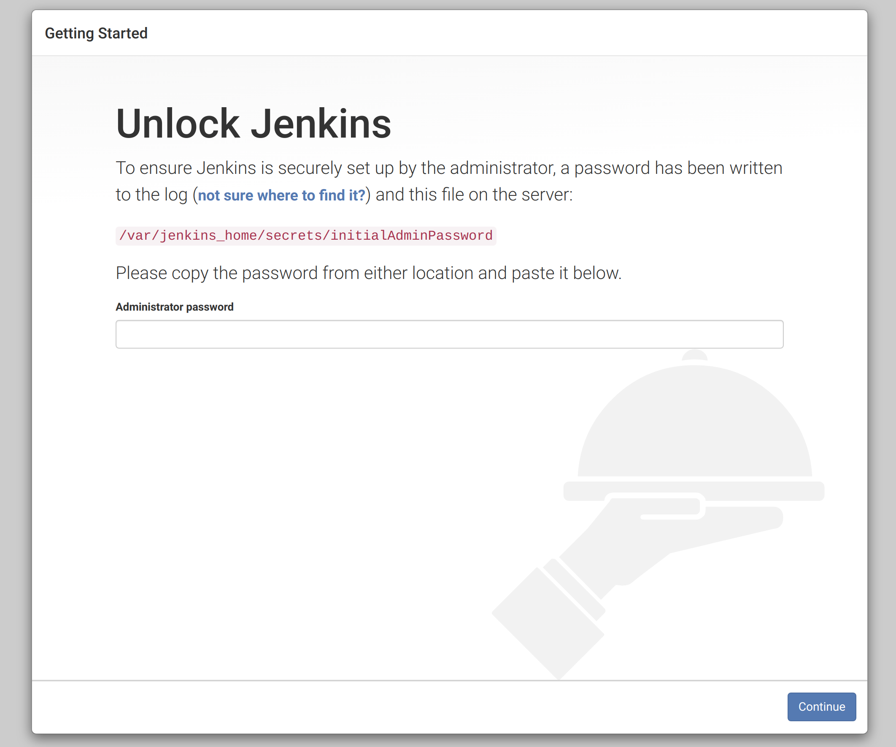
</p>

Copy and paste the Admin password which was displayed in when you started the Jenkins container from above and click `Continue`

Next you'll be asked to Customize Jenkins:

<p align="center">
  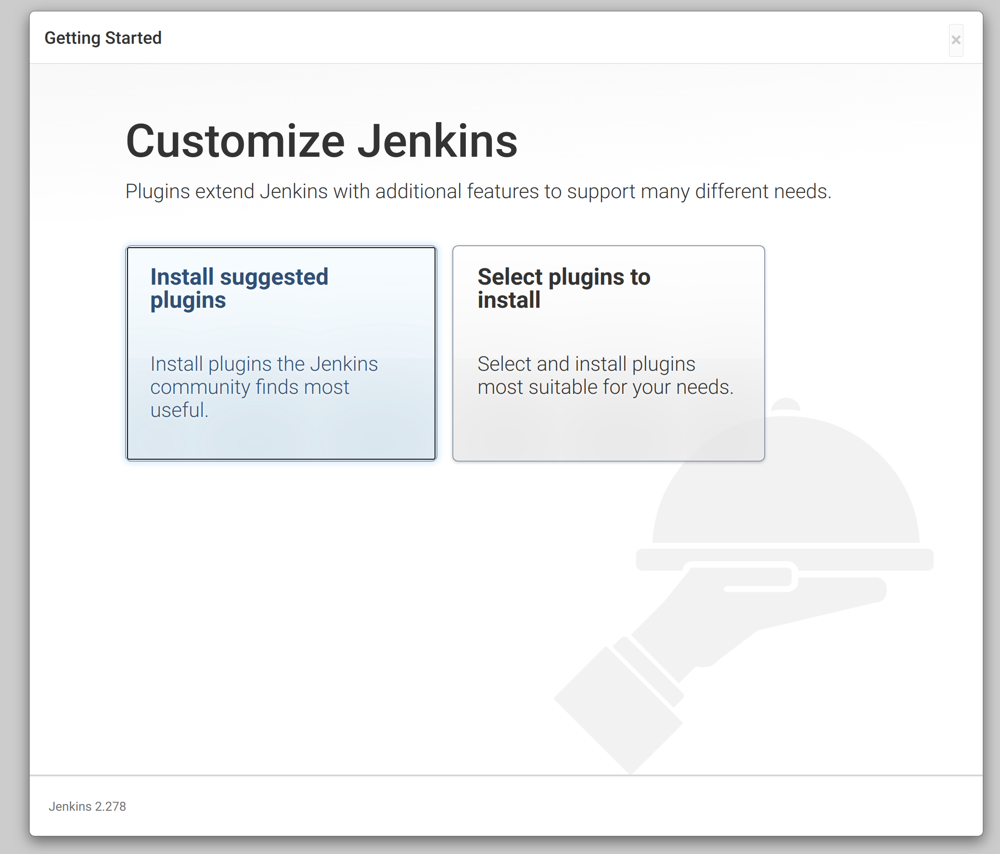
</p>

Select the `Install suggested plugins`

Wait while Jenkins installs the default plugins.

Next, you'll be asked to Create First Admin User:

<p align="center">
  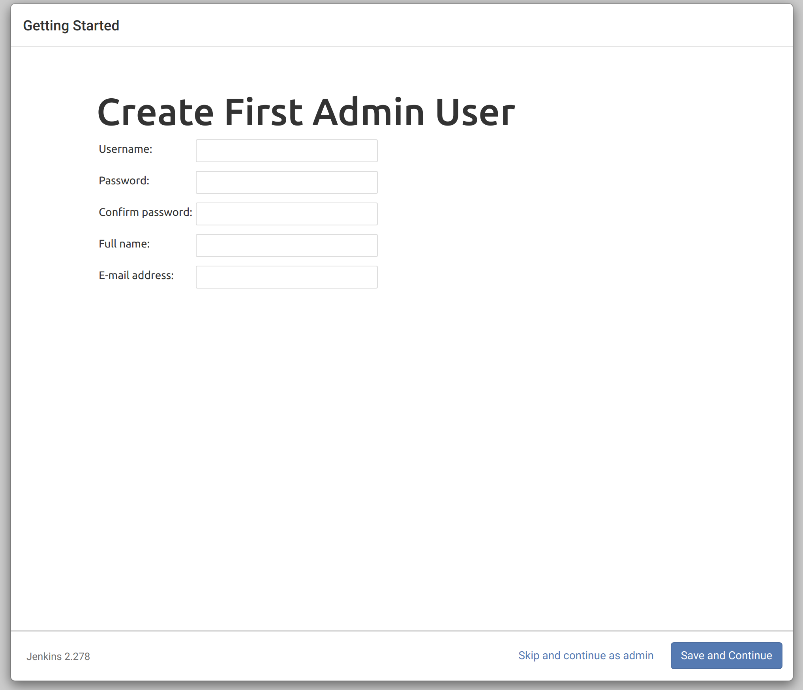
</p>

Enter the required information and click `Save and Continue`.

Next you'll be asked to confirm the url which will be used by Jenkins:

<p align="center">
  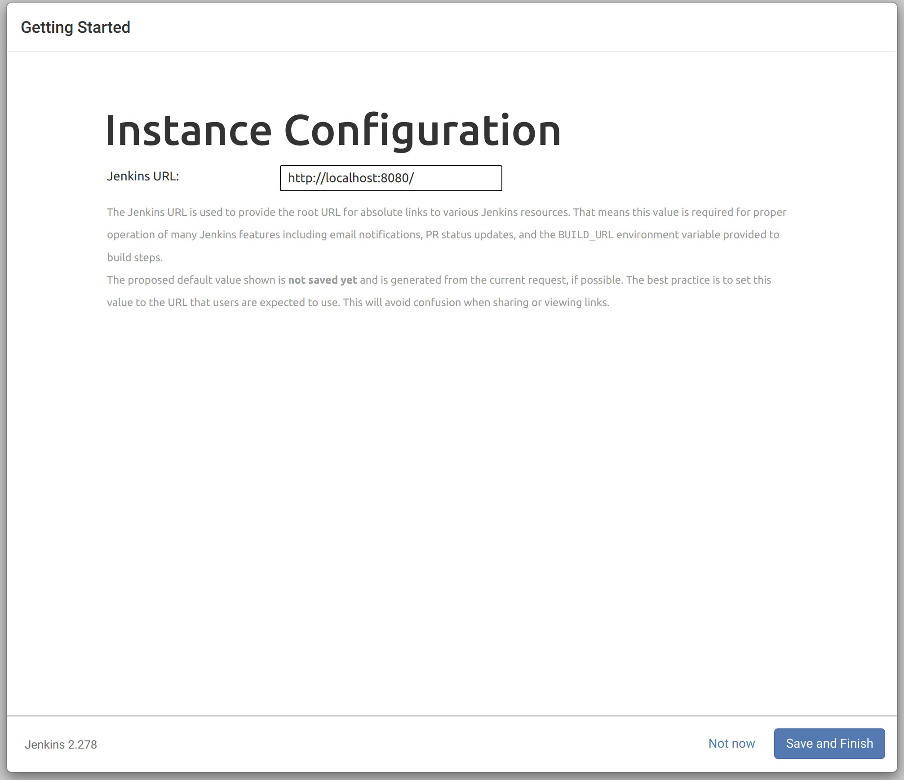
</p>

Click on `Save and Finish`.

Now you'll see the Jenkins Ready screen:

<p align="center">
  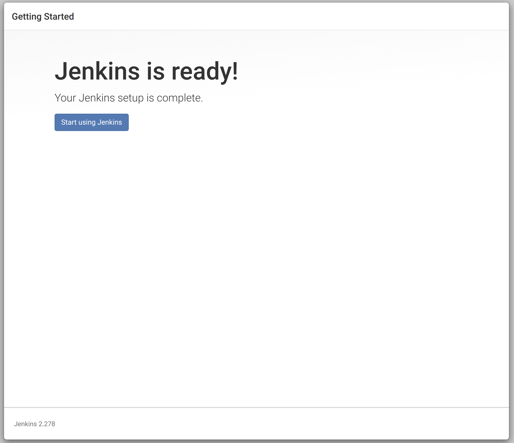
</p>

Click on `Start using Jenkins`.

This will take you to the top level Jenkins dashboard:

<p align="center">
  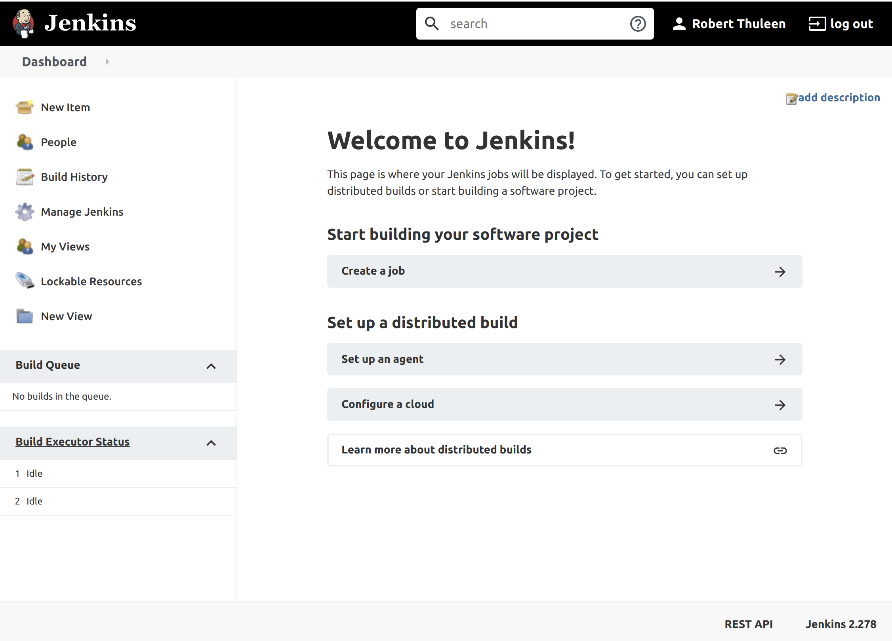
</p>

Now we need to add two plugins to Jenkins in order to use Docker in our pipeline.  

Click on `Manage Jenkins`.

This will take you to the `Manage Jenkins` page:

<p align="center">
  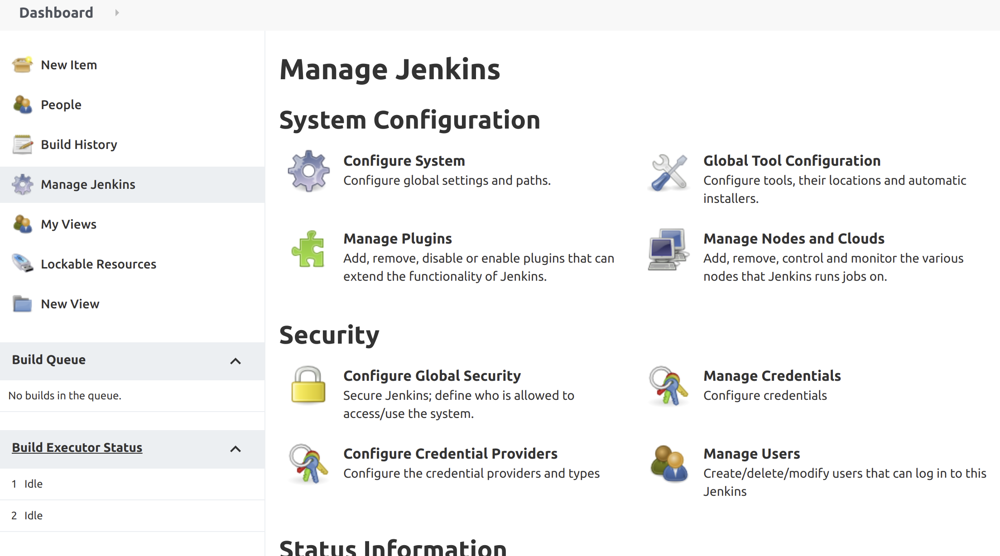
</p>

Now click on the `Manage Plugins` item:

<p align="center">
  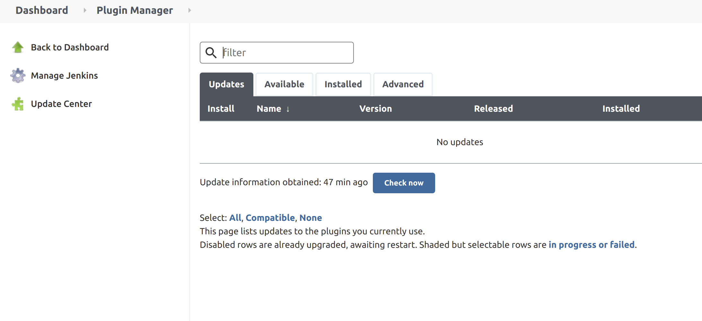
</p>

Click on the `Available` tab and enter `docker` in the search bar. Select the following two plugins and select `Install without restart` at the bottom of the page.

    Docker
    Docker Pipeline

<p align="center">
  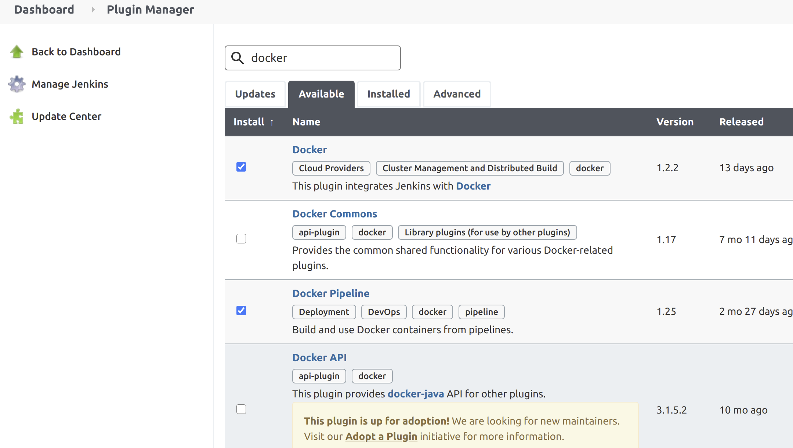
</p>

Next, we'll create our first project.  

Click on `New Item`

<p align="center">
  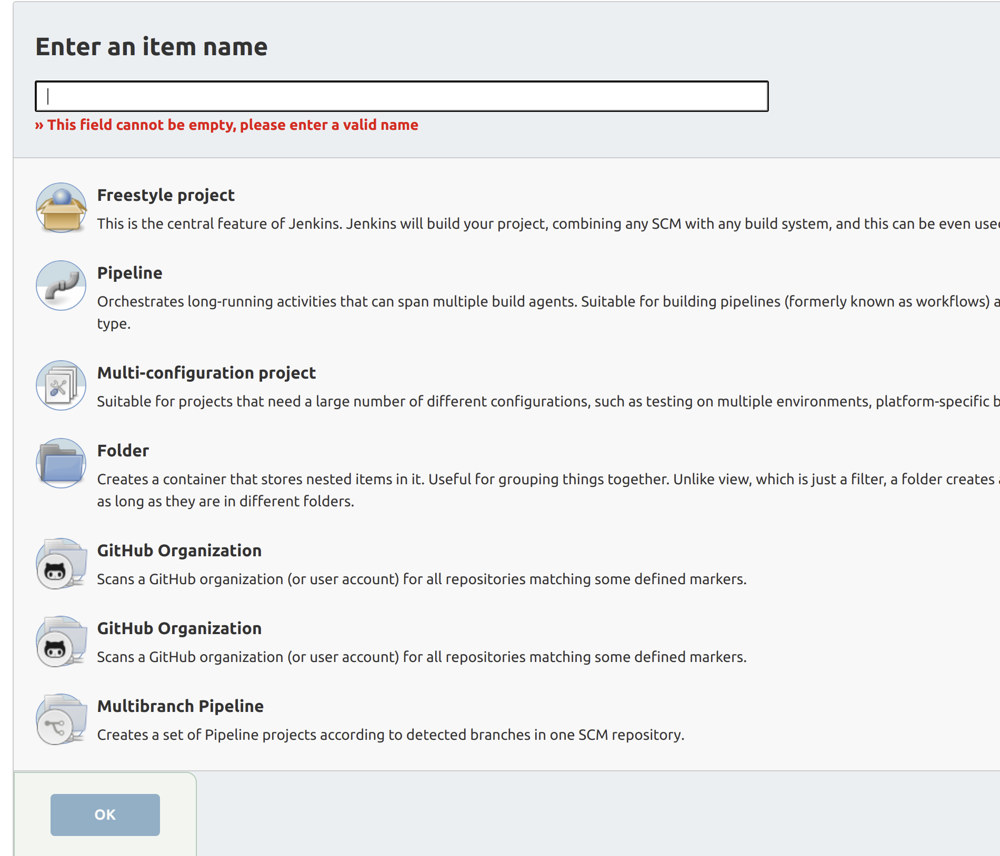
</p>

Enter the name of our project: `node-test-pipeline` and select `Multibranch Pipeline` from the list of project types.

Click on `OK` to continue.

You'll see the project configuration screen:

<p align="center">
  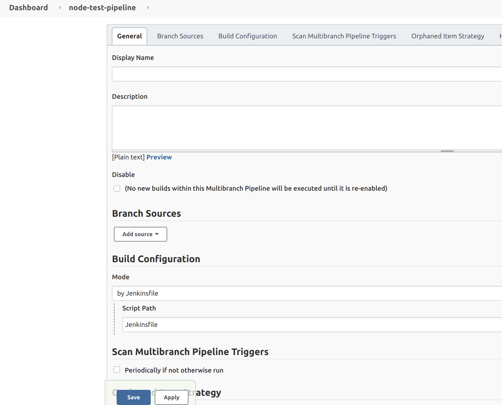
</p>

- In `Display Name` enter `Node Test Pipeline`
- Click on `Add source` and select `GitHub`
- Leave `Credentials` as `- none -`
- Enter the git URL for this repo in the `Repository HTTPS URL` (`https://github.com/rbtdev/jenkins-node-template`)
- Click on `Validate` to ensure the repo is correct
- Leave everything else as is for now

Click on `Save` at the bottom of the screen

The Pipeline job will now begin to run and should complete successfully.


